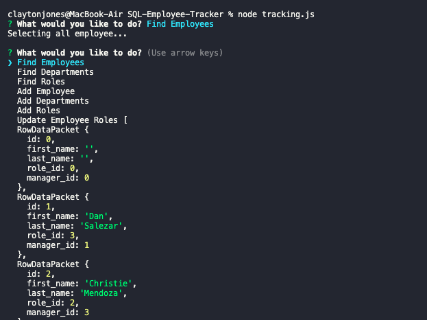

#SQL Employer Tracker

## Description
       The SQL Employer Tracker is designed to allow human resources or any employer to maintain information on many aspects of small, medium, or large businesses or non-profits. The user can check three databases with information on their employees, departments, and roles. When the application is started, it gives the user the ability to view, add, or alter any of the databases that they choose. 

## Installation
Anyone interested in adding to the project or using it for personal or professional use may clone it from github from my repositories. My only request is that you add me. Any comments or suggestions are welcome and appreciated. 

## Usage
None

## Contributing Guidelines
You may alter anything that you believe makes the application more efficiant or user friendly.

## Test Instructions
undefined

## Questions
If you would like to contact me send me an email with the name of the application in the subject line. My contact information is below. 

https://www.github.com/cgjones0711

cgjones0711@gmail.com

## Link To Project
https://github.com/cgjones0711/SQL-Employee-Tracker.git

<iframe src="https://drive.google.com/file/d/1QdyldEtQd-Y7Lwse0UqFo8_sTaX6FWfI/preview" width="640" height="480"></iframe>

